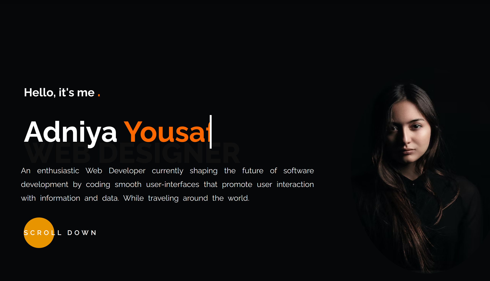

# Portfolio

## Table of contents

- [Overview](#overview)
  - [The challenge](#the-challenge)
  - [Screenshot](#screenshot)
  - [Links](#links)
  - [Built with](#built-with)
  - [What I learned](#what-i-learned)
  - [Continued development](#continued-development)
  - [Useful resources](#useful-resources)


## Overview
This is assignment to create a Portfilio to showcase and pratice your programming skills learned so far.

### The challenge

Users should be able to:

- View the optimal layout for the site depending on their device's screen size
- See hover states for all interactive elements on the page

### Screenshot



### Links

- Live Site URL: [Add live site URL here]()

## My process

### Built with

- Semantic HTML5 markup
- CSS custom properties
- Flexbox
- CSS Grid


### What I learned
This help me learn how to control the layout of a website using Grid.

In this project, I use number Grid-column and Grig-row for the first time and It was exiting. 

```css
.proud-of-this-css {
  grid-column:2/-1;
  grid-row:3/3;
}
```


### Continued development

I would try to make this website even more advance using React once I learned it.

### Useful resources

- [Example resource 1](https://developer.mozilla.org/en-US/) - This helped me for CSS transition. I really liked its material and will use it going forward.
- [Example resource 2](https://www.w3schools.com/) - This is an amazing websit  which helped me finally understand CSS animations. I'd recommend it to anyone still learning Animations.

